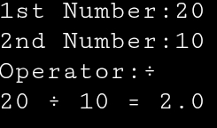

# Python Calculator

This is a simple calculator built using Python.
## 📸 Example Output

## Features
- Addition
- Subtraction
- Multiplication
- Division

## What I Learned
- Taking user input
- Using functions
- Basic logic building in Python

## How to Run
1. Download the file
2. Run using Python
